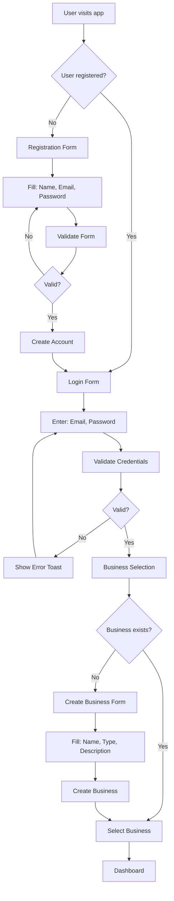
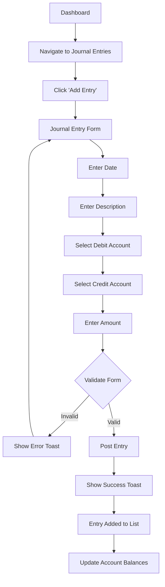
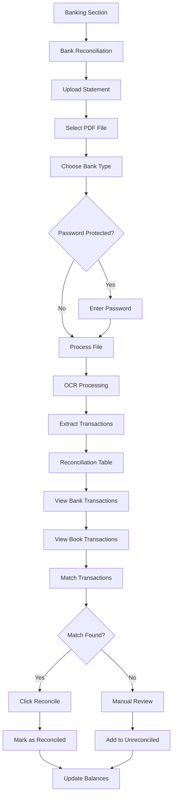
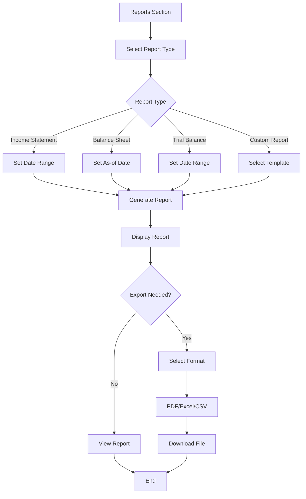
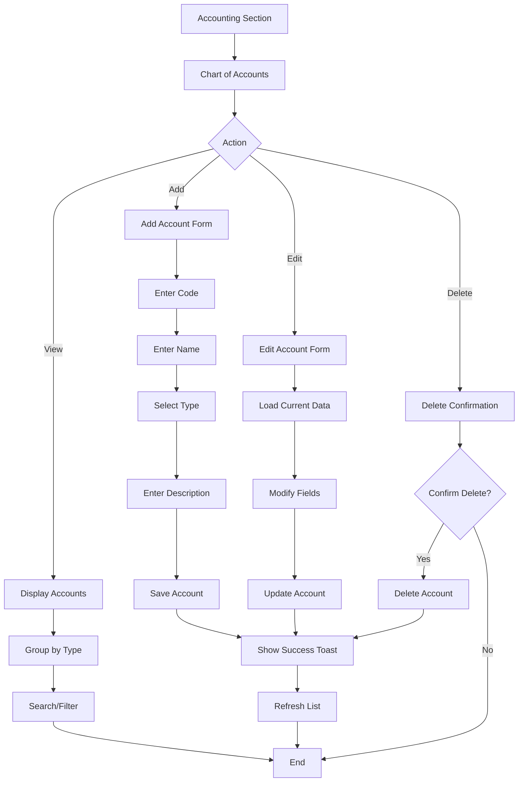
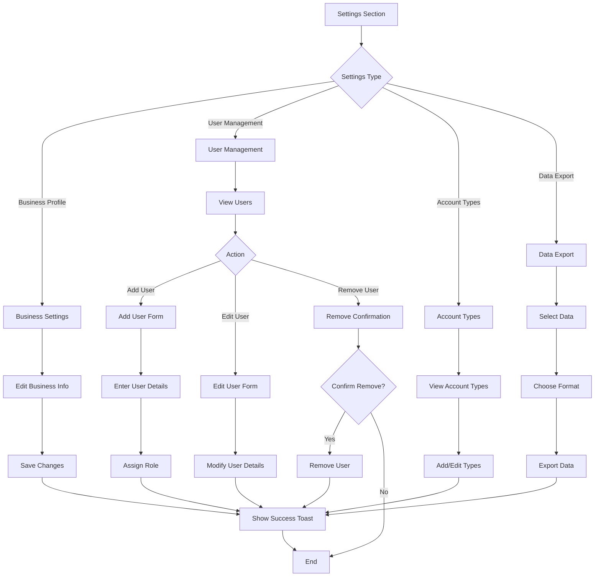
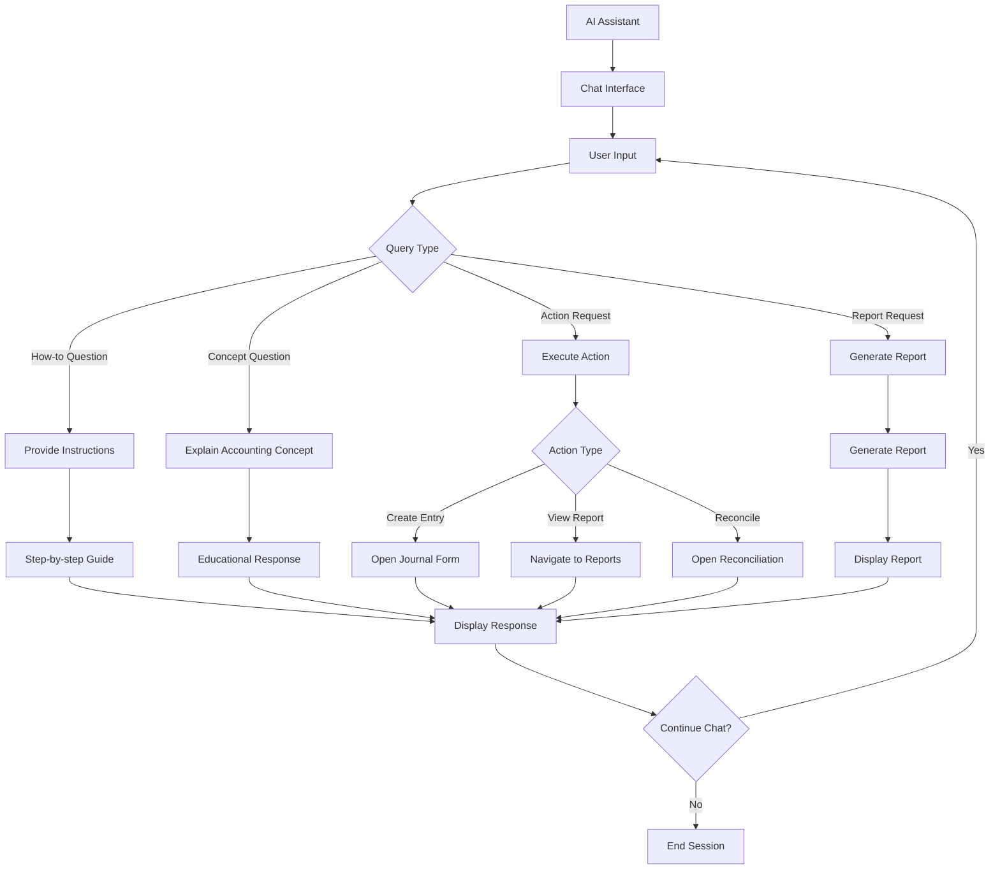
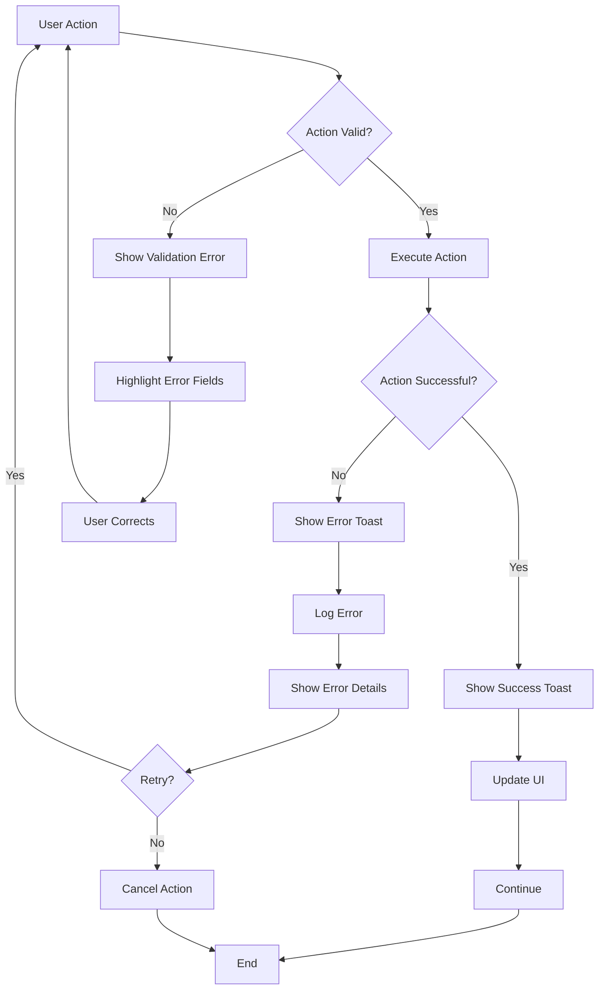
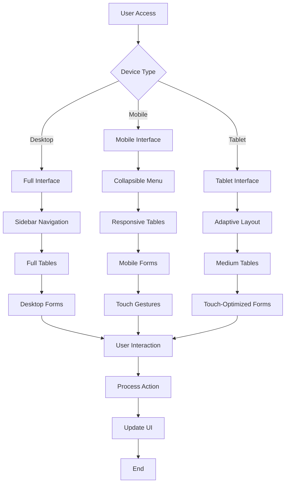
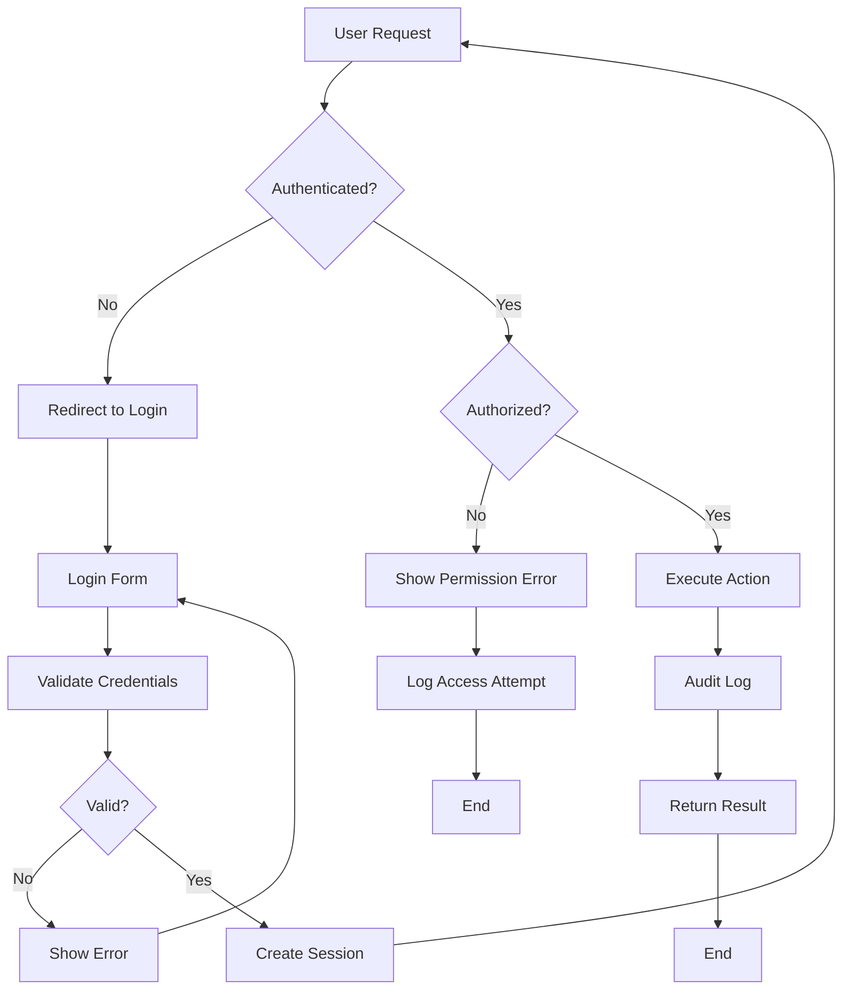

# FinT - User Flow Charts

## 1. Authentication & Onboarding Flow

## 2. Journal Entry Creation Flow

## 3. Bank Reconciliation Flow

## 4. Report Generation Flow

## 5. Chart of Accounts Management Flow

## 6. Settings Management Flow

## 7. AI Assistant Flow

## 8. Error Handling Flow

## 9. Mobile Responsive Flow

## 10. Security & Permissions Flow

These flowcharts provide visual representations of the key user interactions in the FinT accounting application, making it easier to understand the application flow and identify potential improvements. 