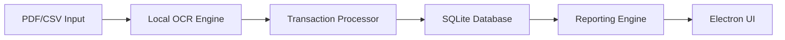
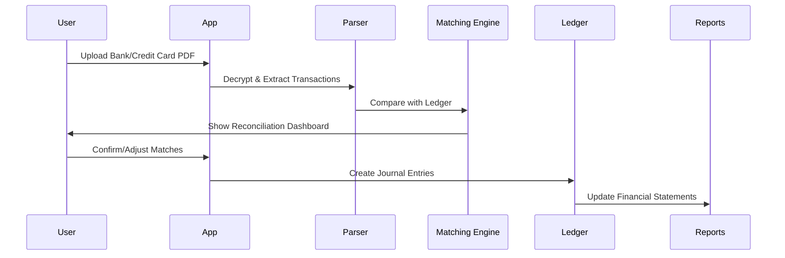

## Local-First Personal & Business Finance Manager - Minimal Viable PRD  

### 1. Core System Principles  
- **Local-Only Operation**: No cloud dependencies (offline-first)  
- **Single-User Focus**: Designed for individual use  
- **Zero Configuration**: Auto-setup with sensible defaults  
- **Data Privacy**: AES-256 encryption at rest  
- **Portable Data**: Single SQLite database file  

---

### 2. Critical Feature Set  

#### **A. Data Capture**  
1. **PDF Statement Processing** (Local OCR):  
   - Password-protected bank/credit card PDF import  
   - Transaction extraction (date, description, amount)  
   - Auto-categorization engine (rule-based)  
   - Manual verification interface  

2. **Smart Journal Entry**:  
   - One-click expense/income logging  
   - Recurring transaction templates  
   - Drag-and-drop receipt/image attachment  
   - Bulk CSV import reconciliation  

#### **B. Accounting Core**  
1. **Automated Chart of Accounts**:  
   - Preconfigured templates:  
     - Personal (Assets/Liabilities/Income/Expenses)  
     - Business (COGS/AR/AP/Equity)  
   - Minimal manual customization  

2. **Self-Balancing Ledger**:  
   - Auto-generated double entries for:  
     - Statement imports  
     - Invoice/bill payments  
     - Account transfers  
   - Real-time imbalance detection  

#### **C. Essential Reporting**  
| Report Type | Frequency | Key Metrics |  
|-------------|-----------|-------------|  
| **Cash Position** | Real-time | Liquid assets, Credit balances |  
| **P&L Summary** | Custom periods | Net income, Top expense categories |  
| **Balance Sheet** | Snapshot | Net worth, Business equity |  
| **Tax Ready** | Annual | Deductible expenses, Income sources |  

---

### 3. Technical Specification  

#### **Local Stack**  


- **Frontend**: Electron + React (Windows/macOS/Linux)  
- **Database**: SQLite (single .db file with AES-256 encryption)  
- **PDF Processing**: pdf.js + Tesseract.js (local OCR)  
- **Storage**: Local filesystem for documents/attachments  

#### **Key Data Model**  
```sql  
-- Minimalist Schema --  
CREATE TABLE accounts (  
  id INTEGER PRIMARY KEY,  
  name TEXT NOT NULL,  
  type TEXT CHECK(type IN ('ASSET','LIABILITY','EQUITY','INCOME','EXPENSE')),  
  balance REAL DEFAULT 0.0  
);  

CREATE TABLE transactions (  
  id INTEGER PRIMARY KEY,  
  date DATE NOT NULL,  
  description TEXT,  
  source_account INTEGER REFERENCES accounts(id),  
  target_account INTEGER REFERENCES accounts(id),  
  amount REAL NOT NULL,  
  document_path TEXT -- Path to original PDF/receipt  
);  

CREATE TABLE rules ( -- Auto-categorization  
  id INTEGER PRIMARY KEY,  
  pattern TEXT, -- e.g. 'STARBUCKS*'  
  account_id INTEGER REFERENCES accounts(id)  
);  
```  

---

### 4. User Workflows  

#### **Statement Processing Flow**:  
1. User adds password-protected PDF via file picker  
2. System decrypts → extracts text → identifies transactions  
3. Auto-applies categorization rules  
4. Presents for verification in reconciliation view:  
   ```  
   [✓] 2023-08-15  AMAZON PRIME     $14.99  (Entertainment)  
   [ ] 2023-08-16  UNKNOWN VENDOR   $42.50  [Select Category ▾]  
   ```  
5. Commits to ledger on confirmation  

#### **Quick-Add Expense**:  
1. Keyboard shortcut opens entry form  
2. Typeahead account selection:  
   ```  
   [Amount]  $23.75  
   [Vendor]  "Whole Foods" → auto-suggests "Groceries"  
   [Attach]  Drag receipt image  
   ```  
3. Saves with balanced entry:  
   `DR Expenses:Groceries $23.75  CR Assets:Cash $23.75`  

---

### 5. Security & Data Integrity  
- **Master Password**: PBKDF2 key derivation for DB encryption  
- **Auto-Backups**: Daily snapshots to user-specified folder  
- **Audit Trail**:  
  ```json  
  { "action": "pdf_import", "file": "chase_q3.pdf", "records_added": 42 }  
  ```  
- **Data Validation**:  
  ```python  
  def validate_transaction(amount, source, target):  
      # Ensure no negative balances for asset accounts  
      if source.type == 'ASSET' and (source.balance - amount < 0):  
          return "Insufficient funds"  
      # Double-entry consistency  
      return source.balance -= amount and target.balance += amount  
  ```  

---

### 6. Installation & Operation  
1. **Setup**:  
   - Download single executable (≤50MB)  
   - Create master password  
   - Select default CoA template (Personal/Business)  

2. **Daily Use**:  
   - Import new statements via "Add Documents"  
   - Verify auto-categorized transactions  
   - Use quick-add for manual entries  
   - Generate reports as PDF/CSV  

3. **Maintenance**:  
   - Compact database (Tools menu)  
   - Export encrypted backup  
   - Reset categorization rules  

---

### 7. Edge Case Handling  
- **Partial Statement Imports**: Flag duplicate transactions  
- **Foreign Currencies**: Single-currency mode (user-selected)  
- **Data Corruption**: Auto-restore from last backup  
- **Rule Conflicts**: Prioritize most specific pattern match  

This streamlined implementation delivers maximum financial management value with:  
- Zero online dependencies  
- 100% local data control  
- <1 minute daily workflow  
- Critical accounting integrity  
- Business/personal flexibility  

Installers target Windows (MSI), macOS (DMG), and Linux (AppImage). Total disk requirement: 150MB.


## India-Focused Local Finance Manager - Minimal PRD  

### 1. India-Specific Adaptations  
- **Currency**: ₹ (INR) as primary currency  
- **Tax Compliance**:  
  - GSTIN tracking (auto-calculate CGST/SGST/IGST)  
  - TDS deduction tracking (Section 194 categories)  
  - HSN/SAC code support for invoices  
- **Banking**:  
  - Pre-configured PDF parsers for:  
    SBI, HDFC, ICICI, Axis, Kotak, PNB  
  - UPI ID integration (virtual payment addresses)  
- **Regulatory**:  
  - Income Tax Act-compliant reporting  
  - MSME billing requirements  

### 2. Critical Feature Set (India Focused)  

#### **A. Data Capture**  
1. **India Bank PDF Processing**:  
   - Auto-detect top 10 Indian bank formats  
   - Password handling for Indian password policies (max 12 char)  
   - GST extraction from vendor invoices  

2. **UPI Transaction Logging**:  
   - Scan QR codes for instant payment logging  
   - Auto-classify UPI transactions (Personal/Business)  

3. **GST-Compliant Invoicing**:  
   - Mandatory fields: GSTIN, HSN, place of supply  
   - Auto-GST calculations (based on Indian tax slabs)  

#### **B. Accounting Core**  
1. **Preconfigured Chart of Accounts**:  
   - Indian business structure (Proprietorship/LLP)  
   - Standard GST accounts:  
     ```mermaid  
     graph LR  
     InputTaxCGST --> GST_Payable  
     InputTaxSGST --> GST_Payable  
     OutputTaxIGST --> GST_Receivable  
     ```  

2. **TDS Management**:  
   - Deduction tracking (Salary/Contractor/Interest)  
   - Form 26Q/24Q generation prep  

#### **C. Essential India Reports**  
| Report | Frequency | Compliance Purpose |  
|--------|-----------|---------------------|  
| **GSTR-1** | Monthly | Outward supplies |  
| **GSTR-3B** | Monthly | GST return summary |  
| **ITR-4** | Annual | Presumptive taxation |  
| **MSME Form-I** | Half-yearly | Vendor payment tracking |  

### 3. Technical Implementation (India Optimized)  

#### **Local Stack**  
- **Database**: SQLite with AES-256 encryption (FIPS 140-2 compliant)  
- **PDF Parsers**: Custom regex engines for:  
  - SBI: `\d{2}-\w{3}-\d{4}.*?₹\d+\.\d{2}`  
  - HDFC: `\d{2}/\d{2} \w+.*CR/DR ₹\d+`  
- **UPI QR Decoder**: `upi://pay?pa=<VPA>&pn=<Name>&am=<Amount>`  

#### **Data Model Additions**  
```sql  
ALTER TABLE transactions  
ADD COLUMN gst_rate REAL,        -- 5%, 12%, 18%, 28%  
ADD COLUMN tds_section TEXT,     -- 194C, 194J, etc.  
ADD COLUMN is_msme BOOLEAN;      -- MSME vendor flag  

CREATE TABLE gst_returns (  
  id INTEGER PRIMARY KEY,  
  period TEXT,                   -- "Jul-2023"  
  gstr1_path TEXT,               -- Output PDF path  
  filing_status TEXT             -- "DRAFT/FILED"  
);  
```  

### 4. User Workflows (India Context)  

#### **GST Invoice Creation**:  
1. User selects "New Tax Invoice"  
2. Auto-fill:  
   - User's GSTIN from profile  
   - Place of Supply (based on pincode)  
3. On save:  
   - Auto-create journal entries:  
     ```  
     DR Customer  
     CR Sales  
     CR GST_Output_IGST  
     ```  

#### **UPI Payment Capture**:  
1. Scan QR code from app  
2. Auto-populate:  
   - Payee VPA  
   - Amount  
   - Transaction ID  
3. Classify as:  
   - Personal expense  
   - Business expense (with GST claim)  
   - Vendor payment (with TDS)  

### 5. India-Specific Security  
- **Encryption**: Compliant with RBI's DPSS guidelines  
- **Data Retention**:  
  - 7 years for GST records  
  - 5 years for banking transactions  
- **Password Rules**:  
  - Minimum 8 characters  
  - Requires numeric + special character  

### 6. Installation & Compliance  
- **System Requirements**:  
  - Windows 10+/macOS 10.15+ (x64 only)  
  - .NET Framework 4.8 (Windows)  
- **Compliance Features**:  
  - Auto-export for:  
    - GST returns (JSON for GSTN portal)  
    - Tax audit reports (Form 3CD)  
  - Presumptive taxation (Section 44AD) calculator  

### 7. Edge Cases (India-Specific)  
- **GST Rounding**: ₹10.28 → ₹10 (if <50p) or ₹11 (if ≥50p)  
- **UPI Disputes**: Flag "FAILED" UPI transactions  
- **Multi-GSTIN**: Handle businesses operating across states  
- **Tax Exemptions**: Special handling for:  
  - Agriculture income (Section 10(1))  
  - Export transactions (0% GST)  

### 8. Localization  
- **Date Format**: DD/MM/YYYY  
- **Number Format**: 1,00,000.00 (Indian lakhs/crores)  
- **Holiday Calendar**: Block dated transactions on national holidays  
- **Regulatory Updates**: Auto-download latest tax rules via secure channel  

This India-optimized solution delivers:  
✅ Full compliance with GST/TDS regulations  
✅ Seamless processing of Indian bank statements  
✅ UPI-integrated cash flow tracking  
✅ Localized for Indian business practices  
✅ 100% offline operation with RBI-grade security  

Installation: Single executable (Windows: .exe, macOS: .dmg) ≤65MB with auto-update capability through trusted Indian CAs.


## India-Focused Finance Manager with Reconciliation & Automated Journal Entries  

### 1. Core Reconciliation System  

**A. Automated Statement Processing Flow**  


**B. Reconciliation Dashboard Features**  
- Side-by-side view: Bank Statement vs. Accounting Records  
- Auto-matching based on:  
  - Amount ± ₹1 tolerance  
  - Date proximity (3-day window)  
  - Reference number mapping  
- Color coding:  
  - 🟢 Exact match (auto-approved)  
  - 🟡 Partial match (needs review)  
  - 🔴 Missing transaction (create new entry)  

---

### 2. Bank-to-Journal Entry Automation  

**A. Transaction Conversion Rules**  
| Bank Description | Journal Entry Template | Account Mapping |  
|------------------|------------------------|----------------|  
| `ATM WDL SBI123` | `DR Cash ₹X CR Bank ₹X` | Assets transfer |  
| `UBER TRIP` | `DR Travel Expense ₹X CR Bank ₹X` | Expense recognition |  
| `ZOMATO PAY` | `DR Meals ₹X CR CC ₹X` + GST tracking | Business expense |  
| `ICICI TFR TO` | `DR Recipient ₹X CR Bank ₹X` | Funds transfer |  

**B. Automated Entry Creation**  
```python  
def create_journal_from_statement(transaction):  
    # Rule-based account mapping  
    account_map = {  
        "ATM": ("Cash", "Bank"),  
        "ZOMATO": ("Meals Expense", "Credit Card"),  
        "SWIGGY": ("Meals Expense", "Credit Card"),  
        "AMAZON": ("Office Supplies", "Credit Card"),  
        "SALARY": ("Bank", "Salary Income")  
    }  

    for keyword, (dr_account, cr_account) in account_map.items():  
        if keyword in transaction.description:  
            return JournalEntry(  
                debit_account=dr_account,  
                credit_account=cr_account,  
                amount=transaction.amount,  
                date=transaction.date,  
                source_ref=transaction.id  
            )  
    return None  # Flag for manual review  
```  

---

### 3. Enhanced Reconciliation Features  

**A. Reconciliation Workflow**  
1. **Import**: Upload password-protected PDF (HDFC/SBI/ICICI)  
2. **Match**: Auto-link to existing transactions using:  
   - Transaction ID (for digital payments)  
   - Check numbers (for cheques)  
   - Amount + date fingerprint  
3. **Reconcile**:  
   - Bulk approval of matched items  
   - Create missing entries directly in reconciliation view  
   - Flag discrepancies > ₹100 for investigation  
4. **Lock**: Close period after reconciliation (prevent edits)  

**B. Reconciliation Reports**  
- `Unreconciled Items Report`: Lists pending transactions  
- `Reconciliation Statement`: Official audit document showing:  
  ```  
  Opening Balance: ₹1,00,000  
  (+) Deposits in transit: ₹15,000  
  (-) Outstanding checks: ₹7,500  
  Adjusted Balance: ₹1,07,500  
  Bank Statement Balance: ₹1,07,500 ✔️  
  ```  

---

### 4. India-Specific Implementation  

**A. Bank Parsers for Top Indian Banks**  
| Bank | Parser Features | Unique Identifiers |  
|------|-----------------|-------------------|  
| **SBI** | Handles 12-digit account numbers | Transaction codes (NEFT/IMPS/UPI) |  
| **HDFC** | Debit/Credit differentiation | Check numbers in memo field |  
| **ICICI** | UPI REF support | Merchant category codes |  
| **Axis** | GST breakdown in descriptions | QR code payment IDs |  

**B. GST-Compliant Reconciliation**  
- Auto-flag transactions needing GSTIN:  
  - Business payments > ₹10,000  
  - Vendor transactions  
- GST reconciliation report:  
  ```  
  Output GST (Sales): ₹12,500  
  Input GST (Purchases): ₹8,400  
  Net GST Payable: ₹4,100  
  ```  

---

### 5. Technical Implementation  

**A. Data Model Extensions**  
```sql  
CREATE TABLE reconciliations (  
  id INTEGER PRIMARY KEY,  
  account_id INTEGER REFERENCES accounts(id),  
  statement_date DATE,  
  closing_balance DECIMAL(12,2),  
  is_locked BOOLEAN DEFAULT 0  
);  

CREATE TABLE statement_lines (  
  id INTEGER PRIMARY KEY,  
  reconciliation_id INTEGER REFERENCES reconciliations(id),  
  transaction_id INTEGER REFERENCES transactions(id) NULL, -- Linked entry  
  date DATE,  
  description TEXT,  
  amount DECIMAL(12,2),  
  status TEXT CHECK(status IN ('MATCHED','UNMATCHED','ADJUSTED'))  
);  
```  

**B. Reconciliation Algorithm**  
```python  
def reconcile_transactions(ledger_entries, statement_lines):  
    matches = []  
    adjustments = []  

    for stmt in statement_lines:  
        # 1. Attempt exact match  
        match = find_match(stmt, ledger_entries, tolerance=1.0)  
        if match:  
            matches.append((stmt, match))  
            continue  

        # 2. Attempt date/amount fuzzy match  
        fuzzy_match = find_fuzzy_match(stmt, ledger_entries, days=3)  
        if fuzzy_match:  
            adjustments.append((stmt, fuzzy_match))  
            continue  

        # 3. Flag for manual creation  
        stmt.status = 'UNMATCHED'  
    
    return ReconciliationResult(matches, adjustments, unmatched)  
```  

---

### 6. User Workflow: Monthly Reconciliation  

1. **Import**:  
   - Download bank statement as PDF  
   - Upload to app → enter password  

2. **Auto-Match**:  
   ```  
   [✔️] 15/08 UPI-12345 ZOMATO ₹425 → Matched #TX10032  
   [⚠️] 17/08 CHEQUE 1234 ₹10,000 → Similar to #TX10041 (₹10,000)  
   [❌] 20/08 ATM WDL SBI ₹5,000 → No match found  
   ```  

3. **Resolve**:  
   - Click ❌ to create journal entry  
   - Review ⚠️ matches via side-by-side comparison  

4. **Close**:  
   - Verify closing balance matches bank statement  
   - Click "Lock Reconciliation" (prevent changes)  
   - Export reconciliation certificate for audit  

---

### 7. Security & Compliance  

**A. Data Protection**  
- Master password encryption (AES-256)  
- Automatic backup encryption  
- RBI-compliant audit trails  

**B. India-Specific Safeguards**  
- PAN number masking in UI  
- GSTIN validation (15-digit format)  
- TDS deduction alerts (Section 194 thresholds)  

**C. Local Storage**  
- All data stored in single encrypted SQLite file  
- Attachments stored in `Documents/FinApp_Attachments`  
- Automatic cleanup of temporary decrypted files  

---

This implementation delivers:  
✅ One-click PDF-to-journal conversion  
✅ Intelligent reconciliation with India-specific rules  
✅ GST-ready transaction tracking  
✅ UPI/IMPS/NEFT payment recognition  
✅ 100% local operation with bank-grade security  

Installation: Single executable (Windows .exe | macOS .app | Linux AppImage) with auto-update through trusted Indian CAs. Supports Hindi and English UI.